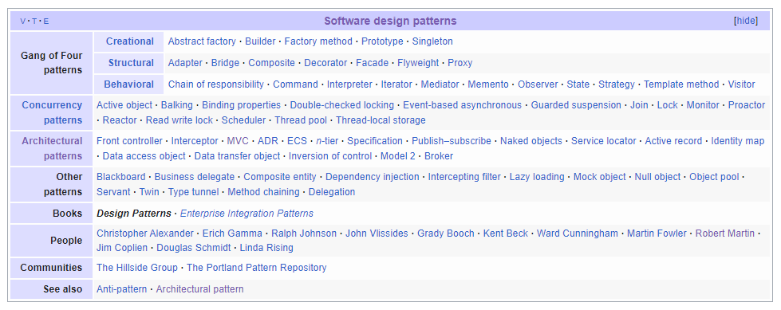

# 디자인 패턴과 프로그래밍 패러다임

## 디자인 패턴
개발에서 발생하는 반복적인 문제들을 해결하기 위한 해결 방법이다.
디자인 패턴은 객체 지향의 4대 특성인 캡슐화, 상속, 추상화, 다형성과 설계원칙 (SOLI)를 기반으로 구성되어있다.

### 1. 싱글톤 패턴; Singleton Pattern
싱글톤 패턴은 하나의 객체의 인스턴스가 오직 하나만 존재하는 패턴이다. 특정 객체가 애플리케이션 전반에서 공유되어야 하거나, 하나의 인스턴스로만 제한해야 하는 경우에 유용된다.

**특징**
- 인스턴스가 하나만 생성된다.
- 생성자로 호출이 되더라도 인스턴스를 새로 생성하지 않고, 기존 인스턴스를 재활용한다.

**장점**
- 유일한 인스턴스 : 단 하나만 존재하는 인스턴스는 객체의 일관된 상태를 유지하고 전역에서 접근이 가능하도록 한다.
- 메모리 절약 : 고정된 메모리 영역을 사용하여 추후 해당 객체에 접근 시 메모리 낭비를 방지할 수 있다.
- 데이터 공유 : 싱글톤 인스턴스는 전역으로 사용되는 인스턴스로 다른 클래스의 인스턴스가 접근할 수 있어 클래스간 데이터 공유가 용이하다. 
- 지연 초기화 : 인스턴스가 실제로 사용되는 시점에서 생성되어 초기 비용을 절약할 수 있다.

**단점**
- 동시성 : 전역으로 사용되는만큼 데이터에 여러 클래스가 동시에 접근하게 될 경우 문제가 발생할 수 있다.
의존성, 멀티스레드 환경
- 다량의 코드 : 멀티스레딩 환경에서 발생할 수 있는 동시성 문제를 해결하기 위하여 코드 자체가 많이 필요하다.
- 테스트 복잡성 : 싱글톤 인스턴스는 자원을 공유하여 격리된 환경에서 테스트를 진행하기 위해서는 매번 인스턴스 환경을 초기화해야한다.

### 2. 팩토리 패턴; Factory Pattern

팩토리 패턴은 클래스로 캡슐화하여, 객체 생성의 구체적인 클래스를 클라이언트로부터 숨긴다. 객체를 생성하는 공장 클래스를 생성하고, 상속하는 서브 공장 클래스가 객체 생성을 각자 책임진다. 객체 생성에 관한 전처리 및 후처리를 통해 생성 과정을 다양하게 처리하여 유연한 처리가 가능하다.

**종류**

팩토리 패턴은 팩토리 메소드 패턴, 추상 팩토리 패턴이 있다.

- 팩토리 매소드 패턴 : 객체를 생성하기 위한 인터페티스를 정의할 떄, 어떤 클래스의 인스턴스를 만들지를 서브 클래스가 결정한다.
- 추상 팩토리 피턴 : 인터페이스를 이용하여 서로 연관되거나 의존하는 객체를 구상 클래스로 지정하지 않고 생성한다.

**특징**
- 객체 생성 로직을 분리하여 코드의 유연성과 확장성이 높다.
- 클래스 생성과 사용의 처리 로직을 분리하여 결합도를 낮출 수 있다.
- 객체의 유형과 종속성을 캡슐화하여 클라이언트로부터의 노출을 막을 수 있다.

**장점**
- 낮은 종속성 : 생성자와 구현 객체의 결합을 피할 수 있다.
- 타입 은닉 : 캡슐화, 추상화를 통해 객체의 구체적인 타입을 감출 수 있다.
- 낮은 결합도와 확장성 : 새로운 객체를 추가할 때 기존 코드를 수정하지 않고 확장할 수 있다.

**단점**
- 클래스의 수 : 각 구현체마다 팩토리 객체를 구현해야하여, 객체 생성에 따라 팩토리 클래스가 증가하고 서브 클래스의 수가 폭증한다.
- 코드 복잡성 : 객체에 따라 팩토리 클래스를 생산하여 코드 복잡성이 증가한다.

### 3. 전략 패턴; Ftrategy Pattern
전략 패턴은 객체들의 행위에 각각의 전략 클래스를 생성하고 유사 행위들을 캡슐화한다. 객체의 행위를 변동하고 싶을 경우에 전략을 변경하여 유연한 확장이 가능하다.

**특징**
- 알고리즘을 캡슐화하여 교체 가능하다.
- 클라이언트 코드와 행동 로직을 독집적으로 분리한다.
- 알고리즘을 다양하게 변경할 수 있게 한다.

**장점**
- 알고리즘 교환 : 런타임에 한 객체 내부에서 사용되는 알고리즘들을 교환할 수 있다.
- 유연한 확장 : 객체 행위를 변동할 떄 직접 수정하지 않고 전략으로 캡슐화한 알고리즘을 변경하여 유연한 확장이 가능하다. 캡슐화로 재사용성도 좋다.
- 독립 테스트 : 캡슐화로 각 알고리즘을 독립적으로 테스트할 수 있다.

**단점**
- 복잡성 : 알고리즘의 수가 적고 변동이 적을 경우, 새로운 클래스들과 인터페이스로 복잡성이 과도하게 증가한다. 또한, 적절한 전략 선택을 위하여 개발자는 전략 간 차이점을 파악하고 있어야한다.
- 객체 관리 : 알고리즘의 수가 많아질 수록 관리해야할 객체의 수가 늘어난다.

### 프로그래밍 패러다임
프로그래밍 패러다임은 전체적인 프로그래밍 방식을 의미한다. 프로그래밍 언어가 문제를 해결하는 방법과 스타일을 정의하는 개념이다. 접근 방식과 사용환경에 따라 유동적으로 활용되며, 각 프로그래밍 패러다임은 장단점과 상호 보완적 특징을 가진다. 대표적인 프로그래밍 패러다임으로는 절차적, 객체지향, 함수형 프로그래밍이 있다.

### 1. 객체 지향 프로그래밍; OOP, Object-Oriented Programming
객체 지향 프로그래밍은 명령형 프로그램의 한 종류로 최소 단위인 객체를 사용하여 데이터와 메소드를 묶고 소통하는 방식이다. 대표적으로 Java가 있다.

**특징**
- 추상화 : 객체의 공통적인 속성과 기능을 추출하여 정의한다.
- 상속 : 기존 클래스를 재활용하여 새로운 클래스를 작성한다.
- 다형성 : 객체의 속성이나 기능이 상황에 따라 여러 형태를 가질 수 있다.
캡슐화 : 연관된 속성과 기능들을 하나의 캡슐로 만들어 외부로부터 데이터를 보호한다.

**장점**
- 유지 보수성 : 각 객체의 독립적인 역할로 코드의 변경을 최소화하고 유지보수가 유리하다.
- 재사용성 : 코드의 재사용으로 반복적인 코드 사용과 복잡성을 줄일 수 있다.
- 직관적 : 인간 친화적이고 직관적인 코드 작성에 용이하다.

**단점**
- 복잡성 : 시스템이 커질수록 클래스 간의 관계가 복잡해질 수 있어 설계에 시간이 많이 소요될 수 있.
- 인간 친화 : 사람이 이해하고 작성하기 편한 방식으로 코드를 나누어 컴퓨터가 이해하고 실행하는데 속도가 느려지거나, 저장 공간을 많이 차지할 수 있다.

### 2. 함수형 프로그래밍; Functional Programming
함수형 프로그래밍은 선영형 프로그래밍의 한 종류로 무엇을 어떻게 해결할지 컴퓨터에게 위임하는 방법 중 하나이다. 최소 단위는 함수이며, 함수를 통해 새로운 데이터를 생성하며 파이프 형태로 프로그래밍을 진행한다. 상태 변화와 부수 효과를 최소화하여 함수 실행 결과가 항상 동일한 결과를 반환하도록 설계된다.

- 순수 함수 : 동일한 입력에 대하여 동일한 출력을 반환하며 외부 상태에 영향을 주지 않는다.
- 불변성 : 데이터 상태를 변경하는 대신, 변견된 새로운 데이터를 생성한다.
- 고차 함수 : 함수를 인자로 받거나 함수를 반환할 수 있다.
- 커리 : 여러 개의 인자를 가진 함수를 하나의 인자를 받는 함수로 변환하는 기법이다.

**특징**
- 작은 문제를 해결하기 위한 함수를 작성하여 가독성이 높고 유지보수가 용이하다. 대입문을 사용하지 않지만 간단한 코드에서도 변수가 할당되고, 값이 대입된다는 특징이 있다.

**장점**
- 재사용성 : 함수 단위로 이루어져 재사용성이 높다.
- 동시성 해결 : 함수 외부의 상태를 수정할 수 없어 동시성 문제를 해결할 수 있다.
- 테스트와 유지보수 : 부수 효과가 없어 테스트와 유지보수에 유리하다.

**단점**
- 순수 함수의 한계 : 순수 함수만으로 모든 문제를 해결하기 어렵다.
- 성능 : 최소 단위로 함수를 분할하면서 메모리 사용량이 증가하거나, 가비지 컬렉션 비용이 증가할 수 있다. 재귀를 사용할 경우에는 스택 오버플로우가 발생 할 수 있다.
- 추상화 수준 : 높은 수준의 추상화로 코드가 간결하고 모듈화되지만, 이해하기 어렵고 복잡해질 수 있다.

## 참고자료
- https://refactoring.guru/ko/design-patterns/singleton
- https://tecoble.techcourse.co.kr/post/2020-11-07-singleton/
- https://ittrue.tistory.com/563
- https://velog.io/@jhbae0420/싱글톤-패턴의-사용-이유와-문제점
- https://velog.io/@wlsrhkd4023/Design-Pattern-싱글톤-패턴Singleton-Pattern-rzs6f6vd
- https://refactoring.guru/ko/design-patterns/factory-method
- https://inpa.tistory.com/entry/GOF-💠-팩토리-메서드Factory-Method-패턴-제대로-배워보자#팩토리_메서드_패턴_구조
- https://refactoring.guru/ko/design-patterns/strategy
- https://inpa.tistory.com/entry/GOF-💠-전략Strategy-패턴-제대로-배워보자
- https://ssdragon.tistory.com/140
- https://velog.io/@codenmh0822/프로그래밍-패러다임
- https://iosdevlime.tistory.com/entry/CSBasic-좀-더-나은-프로그램을-위해-프로그래밍-패러다임
- https://www.codestates.com/blog/content/객체-지향-프로그래밍-특징
- https://sanghyuk.dev/development/2/
- https://mangkyu.tistory.com/111
- https://thecho7.tistory.com/entry/면접-꿀팁-함수형-프로그래밍Functional-Programming이란